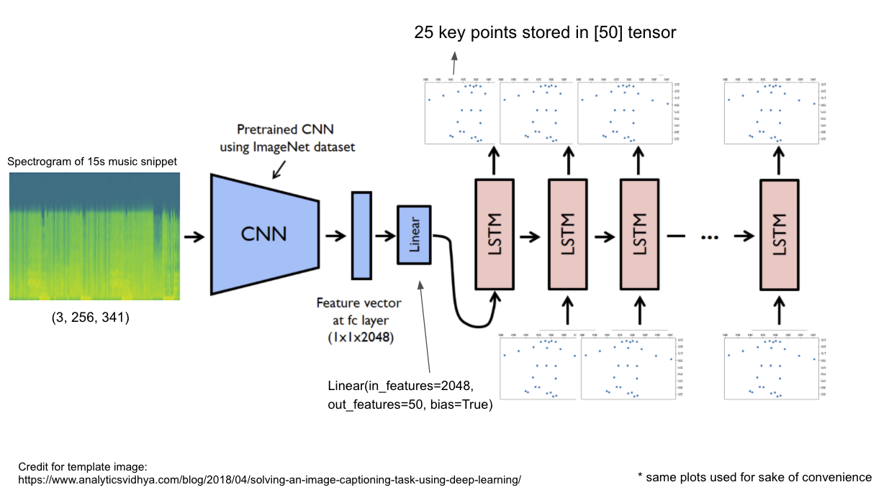

<!--
*** Thanks for checking out the Best-README-Template. If you have a suggestion
*** that would make this better, please fork the repo and create a pull request
*** or simply open an issue with the tag "enhancement".
*** Thanks again! Now go create something AMAZING! :D
***
***
***
*** To avoid retyping too much info. Do a search and replace for the following:
*** github_username, repo_name, twitter_handle, email, project_title, project_description
-->

<!-- PROJECT SHIELDS -->
<!--
*** I'm using markdown "reference style" links for readability.
*** Reference links are enclosed in brackets [ ] instead of parentheses ( ).
*** See the bottom of this document for the declaration of the reference variables
*** for contributors-url, forks-url, etc. This is an optional, concise syntax you may use.
*** https://www.markdownguide.org/basic-syntax/#reference-style-links
-->

<!-- PROJECT LOGO -->
 

  

  <h3 align="center">AI Learns to TikTok</h3>

  

    Training an encoder-decoder (CNN-LSTM) model to generate a dance (or a sequences of poses) from spectrograms of music snippets.

<!--
     
    <a href="https://github.com/github_username/repo_name"><strong>Explore the docs »</strong></a>
     
     
    <a href="https://github.com/github_username/repo_name">View Demo</a>
    ·
    <a href="https://github.com/github_username/repo_name/issues">Report Bug</a>
    ·
    <a href="https://github.com/github_username/repo_name/issues">Request Feature</a>
  

<!-- TABLE OF CONTENTS -->

  
<h2 style="display: inline-block">Table of Contents</h2>

  <ol>
    <li>
      <a href="#about-the-project">About The Project</a>
      <ul>
        <li><a href="#built-with">Built With</a></li>
      </ul>
    </li>
    <li><a href="#overview">Overview</a></li>
    <li><a href="#prerequisites">Prerequisites</a></li>
    <li><a href="#usage">Usage</a></li>
    <li><a href="#shortcomings">Shortcomings</a></li>
    <li><a href="#contributing">Contributing</a></li>
    <li><a href="#license">License</a></li>
    <li><a href="#contact">Contact</a></li>
    <li><a href="#acknowledgements">Acknowledgements</a></li>
    <li><a href="#useful-links">Useful links</a></li>
  </ol>

<!-- ABOUT THE PROJECT -->
## About The Project

I was inspired by the recent TikTok trend. I figured since there are so many users on TikTok, 
it would be quite easy obtaining large amounts of dance video data. This along with my knowledge on pose estimation 
from doing Udacity's Intel Edge AI for IoT Developers Nanodegree and image captioning from doing Udacity's Computer Vision Nanodegree, I felt that this project would be accessible to me. 

### Built With

* [PyTorch](https://pytorch.org/)
* [OpenPose](https://github.com/CMU-Perceptual-Computing-Lab/openpose)

<!-- OVERVIEW -->
## Overview

<h1></h1>

<!-- PREREQUISITES -->
## Prerequisites

OpenPose needs to be installed

<!-- USAGE EXAMPLES -->
## Usage

Refer to Jupyter Notebook in the order corresponding to their indexes

<!-- SHORTCOMINGS -->
## Shortcomings

* (041120) AI only 'sees' left channel of music as you can only create spectrogram from one channel
* (091120) 15 second spectrogram might cause data to be lost
* (091120) In image captioning I dealt with around 10 words, but for a 15 second video at 15fps I will have 225 frames. I don't think the LSTM may work well with a 225 word long sentence
* (141120) Not able to use cv2 and openpose within the same script because of a memory allocation error (TCMalloc); was working fine until I decide not to work in a virtual env for scikit learn to work
* (011220) Tried to overfit the model just for a proof of concept but couldn't get my l1loss below 20. Model will repeat the same predictions after a few frames.

<!-- CONTRIBUTING -->
## Contributing

Contributions are what make the open source community such an amazing place to be learn, inspire, and create. Any contributions you make are **greatly appreciated**.

1. Fork the Project
2. Create your Feature Branch (`git checkout -b feature/AmazingFeature`)
3. Commit your Changes (`git commit -m 'Add some AmazingFeature'`)
4. Push to the Branch (`git push origin feature/AmazingFeature`)
5. Open a Pull Request

<!-- LICENSE -->
## License

Distributed under the MIT License. See `LICENSE` for more information.

<!-- CONTACT -->
## Contact

Gordon - gordonlim214@gmail.com

<!-- ACKNOWLEDGEMENTS -->
## Acknowledgements

* [Udacity](https://www.udacity.com/)

<!-- USEFUL LINKS -->
## Useful Links

* [Human Pose Estimation](https://nanonets.com/blog/human-pose-estimation-2d-guide/)
* [Effects of spectrogram pre-processing for audio classification](https://medium.com/using-cnn-to-classify-audio/effects-of-spectrogram-pre-processing-for-audio-classification-a551f3da5a46)
* [Create csv for dataloader](https://peltarion.com/knowledge-center/documentation/datasets-view/example-workflows---datasets-view/create-new-dataset-/-example-workflow)
* [TCMalloc error](https://google.github.io/tcmalloc/design.html#:~:text=TCMalloc%20is%20a%20memory%20allocator,and%20deallocation%20for%20most%20objects.&text=Low%20overhead%20sampling%2C%20enabling%20detailed%20insight%20into%20applications%20memory%20usage)
* [How to normalize spectrograms](https://enzokro.dev/spectrogram_normalizations/2020/09/10/Normalizing-spectrograms-for-deep-learning.html#:~:text=The%20spectrogram%20is%20a%202,when%20their%20inputs%20are%20normalized)

### YouTube videos

* [Human Pose Estimation on Dancers](https://www.youtube.com/watch?v=Cf6I7YyQDNA&list=PLYvGR0cnCB-IJs8IstTubPkCwnReaI9ZR&index=1)
* [Method to make real person dance from pose data](https://www.youtube.com/watch?v=PCBTZh41Ris&list=PLYvGR0cnCB-IJs8IstTubPkCwnReaI9ZR&index=2)
* [Similar project by Carykh](https://www.youtube.com/watch?v=Sc7RiNgHHaE&list=PLYvGR0cnCB-IJs8IstTubPkCwnReaI9ZR&index=5)
* [Was wondering if data was lost in spectrograms](https://www.youtube.com/watch?v=P9Kozlt0tTg&list=PLYvGR0cnCB-IJs8IstTubPkCwnReaI9ZR&index=6)
* [Building dataloader](https://www.youtube.com/watch?v=PXOzkkB5eH0&list=PLYvGR0cnCB-IJs8IstTubPkCwnReaI9ZR&index=8)
